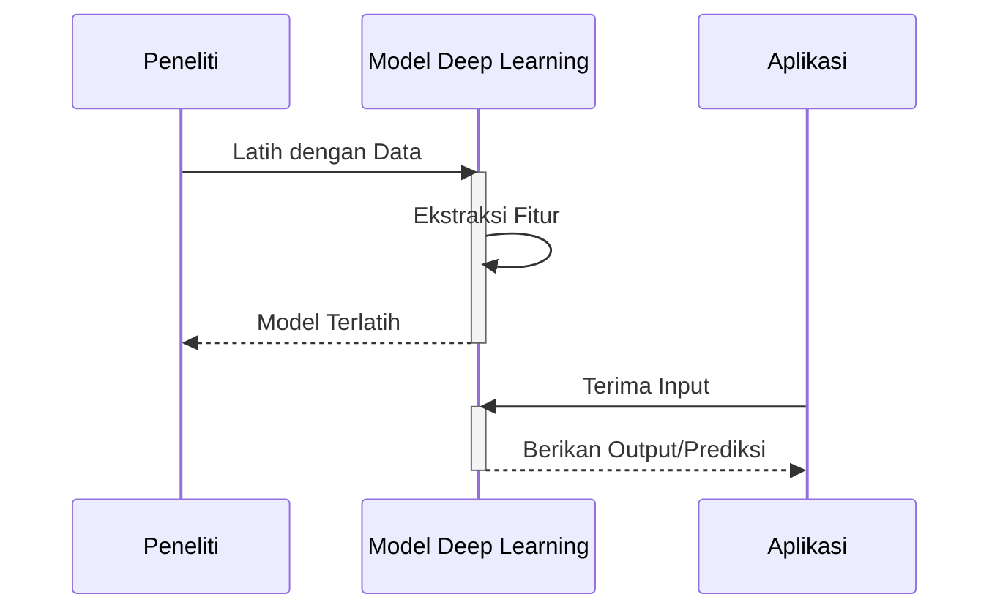

# Menelusuri Jejak Kecerdasan Buatan: Dari Mimpi Filosofis Hingga Realitas Teknologi

**Tanggal Publikasi**: 8 Mei 2025
**Penulis**: Bloggenerator

## Abstrak

Artikel ini akan membawa Anda dalam perjalanan mendalam menelusuri sejarah kecerdasan buatan (AI). Kita akan mulai dari akar filosofisnya pada pemikiran logika dan komputasi, melewati tonggak-tonggak penting seperti Dartmouth Workshop yang menandai lahirnya AI sebagai disiplin ilmu, euforia dan kekecewaan "AI winter", hingga kebangkitan kembali AI di era big data dan deep learning yang kita saksikan saat ini. Kita juga akan membahas berbagai konsep kunci dan tokoh penting yang membentuk lanskap AI modern.

## Awal Mula: Mimpi tentang Mesin Berpikir

Gagasan tentang mesin yang dapat berpikir dan meniru kecerdasan manusia telah lama menghantui imajinasi para filsuf dan ilmuwan. Jauh sebelum komputer elektronik ditemukan, pemikiran tentang logika formal dan sistem simbolik menjadi fondasi awal bagi perkembangan AI.

### Logika dan Komputasi: Akar Filosofis AI

Konsep-konsep seperti silogisme Aristoteles dan upaya Gottfried Wilhelm Leibniz untuk mengembangkan kalkulus universal yang dapat menyelesaikan semua masalah logika merupakan cikal bakal pemikiran tentang representasi pengetahuan dan penalaran otomatis. Pada abad ke-19, karya George Boole tentang aljabar Boolean menyediakan kerangka matematika untuk logika, yang kemudian menjadi sangat penting dalam desain sirkuit digital dan komputasi.

Matematikawan Inggris, Alan Turing, memberikan kontribusi fundamental dengan konsep "Mesin Turing" pada tahun 1936. Mesin abstrak ini mendefinisikan batas-batas komputasi dan menjadi model teoretis untuk komputer universal. Turing juga mengusulkan "Uji Turing" pada tahun 1950 sebagai kriteria untuk mengukur kemampuan mesin untuk menunjukkan kecerdasan yang setara dengan manusia.

$$\text{Mesin Turing} = (Q, \Sigma, \Gamma, \delta, q_0, q_{accept}, q_{reject})$$

Di mana:
- \( Q \) adalah himpunan state (keadaan) yang berhingga.
- \( \Sigma \) adalah alfabet input yang berhingga.
- \( \Gamma \) adalah alfabet pita yang berhingga, di mana \( \Sigma \subseteq \Gamma \).
- \( \delta : Q \times \Gamma \rightarrow Q \times \Gamma \times \{L, R\} \) adalah fungsi transisi.
- \( q_0 \in Q \) adalah state awal.
- \( q_{accept} \in Q \) adalah state penerima.
- \( q_{reject} \in Q \) adalah state penolak.

### McCulloch-Pitts Neuron: Model Komputasi Otak

Pada tahun 1943, Warren McCulloch, seorang neurofisiolog, dan Walter Pitts, seorang matematikawan, mengajukan model matematika sederhana dari neuron biologis. Model "McCulloch-Pitts neuron" ini dianggap sebagai salah satu karya pertama dalam pemodelan komputasi otak dan menjadi inspirasi bagi pengembangan jaringan saraf tiruan di kemudian hari.

## Kelahiran AI sebagai Disiplin Ilmu: Dartmouth Workshop (1956)

Tahun 1956 dianggap sebagai tahun kelahiran resmi kecerdasan buatan sebagai bidang penelitian ilmiah. Dartmouth Workshop, yang diselenggarakan oleh John McCarthy, Marvin Minsky, Claude Shannon, dan Nathaniel Rochester, mempertemukan para peneliti yang memiliki minat yang sama dalam menciptakan mesin yang dapat berpikir.

### Optimisme Awal dan Program Simbolik

Pada masa-masa awal ini, penelitian AI didominasi oleh pendekatan simbolik atau berbasis aturan. Para peneliti percaya bahwa kecerdasan dapat direpresentasikan melalui simbol-simbol dan aturan-aturan logika yang dapat dimanipulasi oleh komputer. Program-program seperti Logic Theorist dan General Problem Solver (GPS) menjadi contoh keberhasilan awal dalam pemecahan masalah logika dan teka-teki.

$$\text{Aturan Produksi: IF } kondisi \text{ THEN } aksi$$

Contoh:
$$\text{IF } (\text{lapar}) \land (\text{ada makanan}) \text{ THEN } (\text{makan})$$

### Kemajuan dalam Bahasa Alami dan Machine Learning Awal

Upaya awal juga dilakukan dalam pemrosesan bahasa alami (natural language processing - NLP) dan machine learning. ELIZA, sebuah program yang dikembangkan oleh Joseph Weizenbaum di MIT, mampu mensimulasikan percakapan dengan menggunakan pola-pola sederhana. Sementara itu, konsep-konsep awal machine learning seperti algoritma perceptron oleh Frank Rosenblatt menunjukkan potensi mesin untuk belajar dari data. Nilai \( \alpha \) dalam algoritma pembelajaran seringkali menentukan kecepatan konvergensi.

## "AI Winter": Fase Kekecewaan dan Kritik

Meskipun ada optimisme besar di awal perkembangannya, penelitian AI mengalami periode stagnasi dan penurunan pendanaan yang dikenal sebagai "AI winter". Beberapa faktor yang menyebabkan hal ini adalah:

### Keterbatasan Pendekatan Simbolik

Pendekatan simbolik terbukti sulit untuk diterapkan pada masalah-masalah dunia nyata yang kompleks dan ambigu. Representasi pengetahuan yang luas dan penalaran yang fleksibel menjadi tantangan besar.

### Kesenjangan antara Teori dan Implementasi

Banyak janji-janji awal AI tidak dapat direalisasikan dalam waktu dekat karena keterbatasan teknologi komputasi pada saat itu. Kompleksitas algoritma AI seringkali melebihi kemampuan perangkat keras yang tersedia.

### Kritik dari Berbagai Perspektif

Kritik dari para filsuf seperti Hubert Dreyfus menyoroti asumsi-asumsi filosofis yang mendasari penelitian AI, terutama mengenai kemampuan mesin untuk benar-benar memahami dan memiliki kesadaran. Laporan-laporan pendanaan penelitian AI juga mulai mempertanyakan hasil-hasil yang telah dicapai.

## Kebangkitan AI: Era Data Besar dan Pembelajaran Mendalam

Setelah melewati masa-masa sulit, AI mengalami kebangkitan yang signifikan pada awal abad ke-21, didorong oleh beberapa faktor utama:

### Ketersediaan Data yang Melimpah (Big Data)

Ledakan data digital dari internet, sensor, dan berbagai perangkat lainnya menyediakan sumber informasi yang kaya untuk melatih model-model AI yang lebih kompleks.

### Kemajuan dalam Kekuatan Komputasi (GPU)

Penggunaan unit pemrosesan grafis (GPUs) yang awalnya dirancang untuk grafis komputer, ternyata sangat efektif dalam mempercepat perhitungan yang dibutuhkan oleh algoritma machine learning, terutama deep learning.

### Pengembangan Algoritma Pembelajaran Mendalam (Deep Learning)

Jaringan saraf tiruan dengan banyak lapisan (deep neural networks) terbukti sangat efektif dalam mempelajari pola-pola kompleks dari data dalam jumlah besar. Keberhasilan deep learning dalam bidang seperti pengenalan gambar, pengenalan suara, dan pemrosesan bahasa alami telah merevolusi banyak aplikasi AI. Fungsi aktivasi seperti \( \sigma(x) = \frac{1}{1 + e^{-x}} \) memainkan peran penting dalam jaringan saraf.

```mermaid
graph TD
    A[Data Besar] --> B(Algoritma Deep Learning);
    C[Kekuatan Komputasi (GPU)] --> B;
    B --> D{Performa AI Meningkat};
    D --> E[Aplikasi AI yang Lebih Canggih];
```



### Aplikasi AI Modern yang Merambah Berbagai Bidang

Saat ini, AI telah menjadi bagian integral dari kehidupan kita sehari-hari. Kita dapat menemukan aplikasi AI dalam berbagai bidang, termasuk:

* **Kendaraan Otonom**: Sistem AI yang memungkinkan mobil untuk mengemudi sendiri.
* **Asisten Virtual**: Aplikasi seperti Siri, Google Assistant, dan Alexa yang dapat memahami perintah suara dan memberikan informasi atau melakukan tugas.
* **Rekomendasi Sistem**: Algoritma yang merekomendasikan produk, film, atau musik berdasarkan preferensi pengguna.
* **Pengobatan dan Kesehatan**: AI digunakan untuk diagnosis penyakit, pengembangan obat, dan personalisasi perawatan.
* **Keuangan**: AI membantu dalam deteksi penipuan, analisis risiko, dan perdagangan algoritmik. Dalam optimasi model, kita seringkali mencari nilai minimum dari fungsi biaya \( J(\theta) \).

## Kesimpulan

Perjalanan sejarah kecerdasan buatan adalah kisah tentang mimpi besar, tantangan yang berat, dan akhirnya, realisasi yang menakjubkan. Dari akar filosofis tentang logika dan komputasi, melalui masa-masa optimisme awal dan "AI winter", hingga kebangkitan kembali di era data besar dan deep learning, AI terus berkembang dengan pesat. Kemajuan dalam algoritma, ketersediaan data, dan peningkatan kekuatan komputasi telah membawa AI dari sekadar konsep teoretis menjadi teknologi transformatif yang memengaruhi hampir setiap aspek kehidupan kita. Masa depan AI menjanjikan potensi yang lebih besar lagi, dengan tantangan dan peluang yang menarik untuk dieksplorasi.

## Referensi (Opsional)

[Sebutkan sumber-sumber yang relevan di sini jika ada]